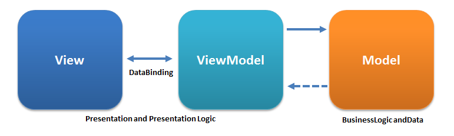

# AwesomeSwiftApp

Supports: iOS 10.x and above

## Application Architecture



## ScreenShots


## Branches:

* release - stable app releases
* master - development branch, merge your feature branches here

## Dependencies:

The project is using cocoapods for managing external libraries and a Gemfile for managing the cocoapods version.

Get Bundler

```
sudo gem install bundler
```

To install the specific cocoapods version run

```
bundle install
```

Then install the pods

```
bundle exec pod install
```

### Core Dependencies

* Swiftlint - A tool to enforce Swift style and conventions.
* SwiftyJSON - The better way to deal with JSON data in Swift.
* R.swift - Get strong typed, autocompleted resources like images, fonts and segues in Swift projects.
* RxSwift - Reactive Programming in Swift.
* RxFlow - RxFlow is a navigation framework for iOS applications based on a Reactive Flow Coordinator pattern.
* Alamofire - An elegant HTTP Networking in Swift
* Hero - An elegant transition library for iOS & tvOS.

## Project structure:

* Flows - app flows, steps and steppers
* Resources - fonts, strings, images, generated files etc.
* SupportingFiles - configuration plist files
* Models - model objects
* Modules - contains app modules (UI + Code)
* Helpers - protocols, extensions and utility classes

## References

* [All Swift Answers](https://www.codegrepper.com/code-examples/swift)
* [RxSwift](https://github.com/ReactiveX/RxSwift)
* [The Coordinator](https://khanlou.com/2015/01/the-coordinator/)
* [Large Titles For Navigation Bars In iOS 11](https://chariotsolutions.com/blog/post/large-titles-ios-11/)
* [一天精通iOS Swift多线程（GCD）](https://juejin.im/post/6858126631760986126)
* [iOS多线程:GCD](https://juejin.im/post/6844903783110017031)
* [Solving ambiguous constraints without rerunning your app](https://mar.codes/blog/constraints)
* [Auto layout magic: content sizing priorities](https://krakendev.io/blog/autolayout-magic-like-harry-potter-but-real)
